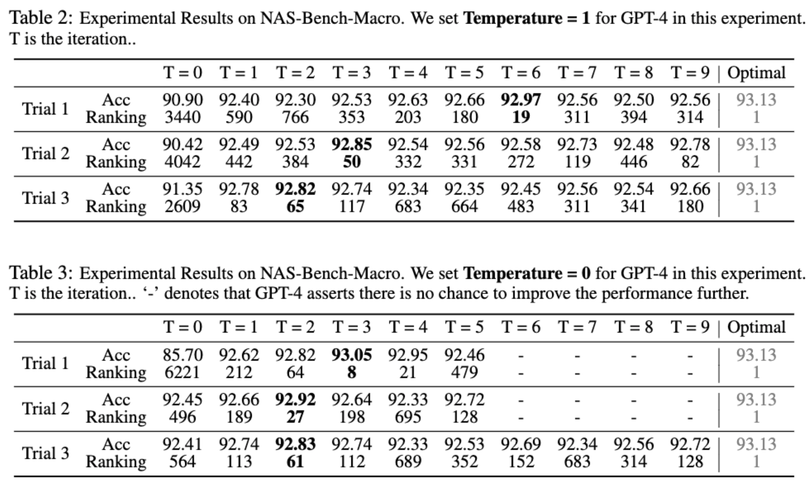
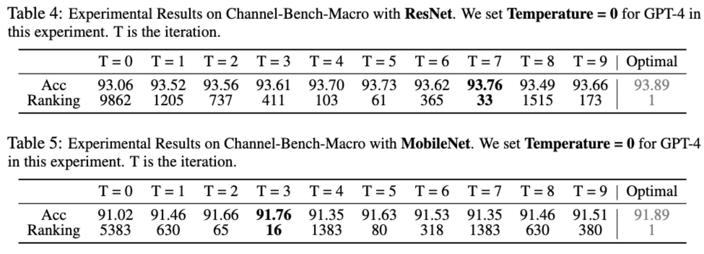
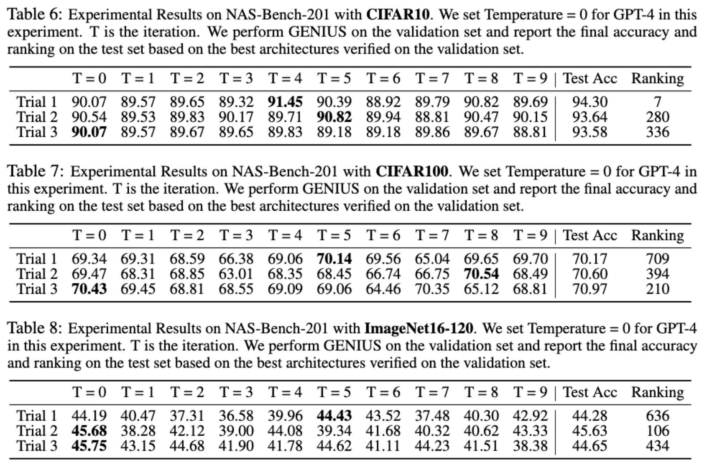

# Can GPT-4 Perform Neural Architecture Search?

## Retrival Performance From Benchmark

### * NAS-Bench-Macro 
```
python get_performance.py --benchmark nas-macro --arch xxxxxxxx
```
xxxxxxxx is 8 numbers (e.g. 01201201) which representes the operation for each layer. There are three different choices for each layer, you can use [0, 1, 2] to represents the operations. The details and avialable operations can be found in [prompt/nas-bench-macro.md](prompt/nas-bench-macro.md)

<p align="center"></p>


### * Channel-Bench-Macro 
```
python get_performance.py --benchmark channel-res --arch 'xx, xx, xx, xx, xx, xx, xx'
python get_performance.py --benchmark channel-mob --arch 'xx, xx, xx, xx, xx, xx, xx'
```
Use ``channel-res`` for ResNet base model and ``channel-mob`` for MobileNet base model. xx represents the channel numers of each layer. You can find the details for the avialable channel numbers in [prompt/channel-bench-resnet.md](prompt/channel-bench-resnet.md) and [prompt/channel-bench-mobilenet.md](prompt/channel-bench-mobilenet.md)

<p align="center"></p>

### * NAS-Bench-201
```
python get_performance.py --benchmark 201-cifar10  --arch xxxxxx
python get_performance.py --benchmark 201-cifar100 --arch xxxxxx
python get_performance.py --benchmark 201-imagenet --arch xxxxxx
```
Use ``201-cifar10``, ``201-cifar100``, and ``201-imagenet`` for CIFA10, CIFAR100, and ImageNet16-120 respectively. xxxxxx is 6 numbers (e.g. 213401) which representes the operation for each edge. There are three different choices for each layer, you can use [0, 1, 2, 3, 4] to represents the operations. The details and avialable operations can be found in [prompt/nas-bench-201.md](prompt/nas-bench-201.md)

<p align="center"></p>
